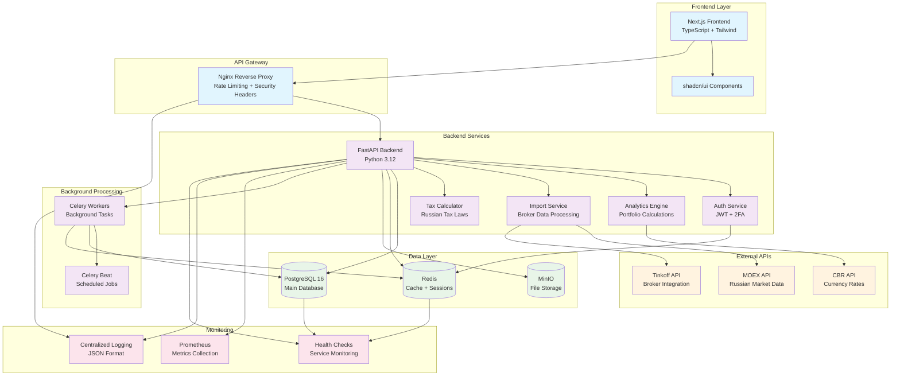

# 🚀 Dohodometr - Профессиональный сервис учета инвестиций

[](./SECURITY.md)
[](./HARD_REVIEW_REPORT.md)
[](#testing)
[](./LICENSE)
[](./COMPLIANCE_RF.md)

> **Доходометр** — профессиональный облачный сервис для учета и анализа инвестиционных портфелей российских инвесторов с полным соответствием законодательству РФ.


## 📋 Содержание

- [🎯 Возможности](#-возможности)
- [🏗️ Архитектура](#️-архитектура)  
- [🛠 Технологический стек](#-технологический-стек)
- [🚀 Быстрый старт](#-быстрый-старт)
- [🔧 Разработка](#-разработка)
- [🧪 Тестирование](#-тестирование)
- [🚢 Деплой](#-деплой)
- [🔒 Безопасность](#-безопасность)
- [📊 Мониторинг](#-мониторинг)
- [🤝 Участие в разработке](#-участие-в-разработке)
 - [🧠 Нейросотрудники (Оркестратор)](#-нейросотрудники-оркестратор)

## 🎯 Возможности

### 💼 Управление портфелями
- ✅ Создание и управление множественными портфелями
- ✅ Поддержка различных типов счетов (брокерские, ИИС, пенсионные)
- ✅ Учет акций, облигаций, ETF, валют и кастомных активов
- ✅ FIFO учет позиций с автоматическим расчетом P&L

### 📈 Импорт и аналитика
- 🔄 **Автоматический импорт** из CSV/XLS отчетов основных брокеров РФ:
  - 🏦 Тинькофф Инвестиции
  - 🏦 Сбербанк Инвестор  
  - 🏦 ВТБ Капитал
  - 🏦 БКС
  - 🏦 Финам
  - 🏦 Открытие Брокер
- 📊 **Расчет метрик доходности**: TWR, XIRR, Sharpe ratio
- 💱 **Валютная переоценка** с историческими курсами ЦБ РФ
- 📈 **Бенчмаркинг** с индексами IMOEX, RTS, S&P 500

### 📊 Визуализация и отчеты
- Интерактивные графики стоимости портфеля
- Сравнение с бенчмарками (IMOEX, S&P 500)
- Диаграммы распределения по классам активов, секторам, странам
- Календарь дивидендов и купонов
- Экспорт данных в CSV

### 🎯 Планирование и цели
- Установка целей по капиталу или пассивному доходу
- Сценарное моделирование с учетом взносов и реинвестирования
- Прогнозирование достижения финансовых целей

### 🔔 Уведомления
- Email-уведомления о дивидендах и экс-дивидендных датах
- Оповещения о пороговых изменениях цен
- Еженедельные сводки по портфелю

## 🏗️ Архитектура

Dohodometr построен по принципам чистой архитектуры с микросервисным подходом:

<div align="center">



</div>

## 🛠 Технологический стек

<table>
<tr>
<td valign="top" width="50%">

### 🎨 Frontend
- **Next.js 14** — React фреймворк с SSR
- **TypeScript** — строгая типизация
- **Tailwind CSS** — utility-first CSS
- **shadcn/ui** — современные компоненты
- **React Query** — управление состоянием API
- **Recharts** — визуализация данных

</td>
<td valign="top" width="50%">

### ⚙️ Backend
- **Python 3.12** — современный Python
- **FastAPI** — высокопроизводительный API
- **SQLAlchemy** — ORM с типизацией
- **Alembic** — миграции базы данных
- **Pydantic** — валидация данных
- **Celery** — фоновые задачи

</td>
</tr>
<tr>
<td valign="top">

### 🗄️ База данных
- **PostgreSQL 16** — основная БД
- **Redis** — кеш и сессии
- **MinIO** — объектное хранилище

</td>
<td valign="top">

### 🔒 Безопасность
- **JWT** с refresh токенами
- **TOTP 2FA** — двухфакторная аутентификация
- **Argon2** — хеширование паролей
- **AES-256-GCM** — шифрование данных

</td>
</tr>
</table>

### Frontend  
- **Next.js 14** (App Router) + **React 18** + **TypeScript**
- **TailwindCSS** + **shadcn/ui** для современного интерфейса
- **React Query** для управления состоянием
- **Recharts** для интерактивных графиков

### DevOps & Безопасность
- **Docker** + **docker-compose** для контейнеризации
- **Traefik** reverse proxy с **Let's Encrypt** TLS
- **Prometheus** + **Grafana** для мониторинга
- Соответствие **OWASP ASVS L2** и **OWASP Top 10**
- Шифрование чувствительных данных (AES-256-GCM)

## 🚀 Быстрый старт

### Требования
- Docker 20.x+
- Docker Compose 2.x+
- Node.js 18+ (для разработки frontend)
- Python 3.12+ (для разработки backend)

### Запуск в development режиме

1. **Клонируйте репозиторий:**
```bash
git clone <repository-url>
cd investment-service
```

2. **Настройте переменные окружения:**
```bash
cp env.example .env
# Отредактируйте .env файл с вашими настройками
```

3. **Запустите сервисы:**
```bash
# Запуск всех сервисов (база данных, backend, frontend)
docker-compose -f docker-compose.dev.yml up -d

# Или запуск по отдельности:
docker-compose -f docker-compose.dev.yml up -d db redis minio  # Инфраструктура
docker-compose -f docker-compose.dev.yml up backend            # Backend API
docker-compose -f docker-compose.dev.yml up frontend           # Frontend
```

4. **Выполните миграции базы данных:**
```bash
cd backend
source venv/bin/activate
alembic upgrade head
```

5. **Откройте приложение:**
- Frontend: http://localhost:3000
- Backend API: http://localhost:8000
- API Docs: http://localhost:8000/docs
- Grafana: http://localhost:3001 (admin/admin)

### Запуск в production режиме

1. **Подготовьте сервер (Ubuntu 22.04 LTS):**
```bash
# Настройте домен и DNS
# Установите Docker и docker-compose
curl -fsSL https://get.docker.com -o get-docker.sh
sh get-docker.sh

# Настройте UFW firewall
ufw allow 22,80,443/tcp
ufw enable
```

2. **Настройте production окружение:**
```bash
cp env.example .env.prod
# Настройте production переменные (домен, пароли, секреты)
```

3. **Запустите production сборку:**
```bash
docker-compose -f docker-compose.prod.yml up -d
```

4. **Настройте автоматические бэкапы:**
```bash
# Добавьте в crontab
0 2 * * * cd /path/to/app && docker-compose -f docker-compose.prod.yml exec -T db pg_dump -U postgres investment_db | gzip > backups/backup_$(date +\%Y\%m\%d).sql.gz
```

## 📁 Структура проекта

```
investment-service/
├── backend/                 # FastAPI приложение
│   ├── app/
│   │   ├── api/            # API endpoints
│   │   ├── core/           # Конфигурация, безопасность, БД
│   │   ├── models/         # SQLAlchemy модели
│   │   ├── repositories/   # Репозитории для работы с БД
│   │   ├── services/       # Бизнес-логика
│   │   └── tasks/          # Celery задачи
│   ├── migrations/         # Alembic миграции
│   └── tests/             # Тесты
├── frontend/               # Next.js приложение
│   ├── app/               # App Router страницы
│   ├── components/        # React компоненты
│   ├── lib/              # Утилиты и API клиент
│   └── hooks/            # Custom React hooks
└── infra/                # Docker, конфигурации
    ├── postgres/
    ├── redis/
    ├── traefik/
    └── prometheus/
```

## 🔑 Примеры использования

### Импорт отчета брокера

1. Войдите в приложение
2. Создайте портфель и счет
3. Перейдите в раздел "Импорт"
4. Загрузите CSV файл от вашего брокера
5. Система автоматически определит формат и импортирует транзакции

**Поддерживаемые форматы CSV:**

```csv
# Тинькофф
Дата;Время;Тип операции;Тикер;Количество;Цена;Сумма;Валюта;Комиссия
01.01.2024;10:00:00;Покупка;SBER;10;250.50;2505.00;RUB;5.00

# Сбербанк  
Дата сделки;Операция;Код инструмента;Кол-во;Цена;Сумма сделки;Валюта;Комиссия брокера
01.01.2024;Покупка ЦБ;SBER;10;250.50;2505.00;RUB;5.00
```

### REST API примеры

```bash
# Получение портфелей
curl -H "Authorization: Bearer YOUR_JWT_TOKEN" \
     http://localhost:8000/api/v1/portfolios/

# Создание портфеля
curl -X POST -H "Authorization: Bearer YOUR_JWT_TOKEN" \
     -H "Content-Type: application/json" \
     -d '{"name":"Мой портфель","base_currency":"RUB"}' \
     http://localhost:8000/api/v1/portfolios/

# Получение аналитики
curl -H "Authorization: Bearer YOUR_JWT_TOKEN" \
     "http://localhost:8000/api/v1/analytics/performance?portfolio_id=1&period=1y"
```

## 🔒 Безопасность

Сервис реализует строгие требования безопасности:

- **Аутентификация**: JWT с refresh токенами (15 мин / 7 дней)
- **2FA**: TOTP с QR-кодами и резервными кодами
- **Шифрование**: AES-256-GCM для чувствительных данных
- **Хеширование паролей**: Argon2id
- **Rate limiting**: Защита от брутфорса
- **HTTPS**: TLS 1.2+ с HSTS заголовками
- **CORS**: Ограниченный список доменов
- **Аудит**: Логирование всех действий пользователей

## 📊 Мониторинг

Включенные дашборды Grafana:
- Производительность приложения (CPU, память, сеть)
- Метрики базы данных (подключения, запросы)
- Пользовательская активность
- Бизнес-метрики (количество портфелей, транзакций)

## 🧪 Тестирование

```bash
# Backend тесты
cd backend
python -m pytest tests/ -v --cov=app

# Frontend тесты  
cd frontend
npm test

# E2E тесты
npm run test:e2e
```

## 📝 Документация API

После запуска приложения доступна по адресам:
- Swagger UI: http://localhost:8000/docs
- ReDoc: http://localhost:8000/redoc
- OpenAPI JSON: http://localhost:8000/openapi.json

## 🚀 Production Деплой

### ⚡ VPS Деплой (Рекомендуется)
**Полностью автономный сервис на вашем сервере:**

```bash
# На VPS сервере (Ubuntu 22.04+)
curl -fsSL https://raw.githubusercontent.com/YOUR_REPO/main/deploy_vps.sh | sudo bash
```

**Результат:** https://youinvest.duckdns.org  
**Стоимость:** ~$25-30/месяц  
**Время установки:** 15-20 минут  

**📋 Инструкции:**
- **[VPS_FINAL_INSTRUCTIONS.md](VPS_FINAL_INSTRUCTIONS.md)** - Главная инструкция
- **[VPS_REQUIREMENTS.md](VPS_REQUIREMENTS.md)** - Требования к серверу
- **[QUICK_VPS_SETUP.md](QUICK_VPS_SETUP.md)** - Быстрый старт

### 🏠 Локальный + Vercel Деплой
**Гибридное решение:**
```bash
./deploy_youinvest.sh
```

**Результат:** https://www.youinvest.duckdns.org

**Подробности:** [QUICK_DEPLOY.md](QUICK_DEPLOY.md) | [PRODUCTION_DEPLOY.md](PRODUCTION_DEPLOY.md)

**Архитектура:**
- **VPS**: Полностью автономный сервис  
- **Гибрид**: Frontend (Vercel) + Backend (локальный + туннель)

---

## 🤝 Вклад в развитие

1. Форкните репозиторий
2. Создайте feature ветку (`git checkout -b feature/amazing-feature`)
3. Коммитьте изменения (`git commit -m 'Add amazing feature'`)
4. Запушьте в ветку (`git push origin feature/amazing-feature`)
5. Откройте Pull Request

## 📄 Лицензия

Этот проект лицензируется под MIT License - см. [LICENSE](LICENSE) файл.

## 🆘 Поддержка

- 📧 Email: support@investment-service.ru
- 💬 Telegram: @investment_service_support
- 📖 Wiki: [GitHub Wiki](../../wiki)
- 🐛 Issues: [GitHub Issues](../../issues)

---

**⭐ Если проект оказался полезным, поставьте звездочку на GitHub!**

## 🧠 Нейросотрудники (Оркестратор)

Для взаимодействия через Cursor используйте Оркестратора: см. `docs/ops/agents-invoke.md`.